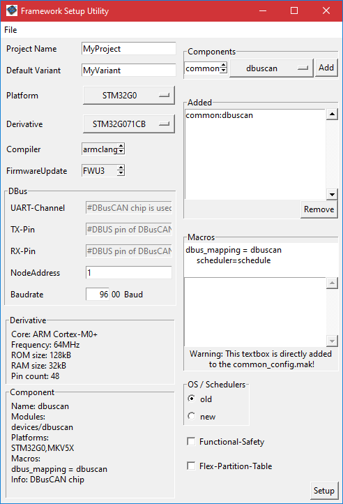

# DBusCAN chip
DBusCAN is an ASIC (Application-Specific Integrated Circuit) chip. Basically, it is both CAN FD and DBus controller with an integrated CAN FD and DBus transceivers. The DBus part of the DBusCAN chip replaces the data link layer of DBus-2.2 SW stack and thus provides robust hardware-based solution. For communication with a microcontroller the SPI interface and interrupt pin is provided.

More information about the DBusCAN chip specification and features can be found in the [datasheet](https://wiki.bsh-sdd.com/display/ASSA/DBusCAN+System+Basic+Chip?preview=/2607055673/3435946380/sllsfo1.pdf) and on the wiki page [DBusCAN System Basic Chip](https://wiki.bsh-sdd.com/display/ASSA/DBusCAN+System+Basic+Chip).

## 1. Using DBusCAN chip in MCU Framework

To use DBusCAN chip in MCU Framework, you need to [set project via Setup Utility](https://wiki.bsh-sdd.com/display/PFS/How+to+Setup+project) with the dbuscan component added from the list of common components.

<newline>


After completing project setup, the Setup Utility automatically generates the definition of a make variable dbus_mapping to the "dbuscan" option into the common_config.mak file (in the section # global build settings): `dbus_mapping=dbuscan`

After completing project setup and build, there is a corresponding definition generated in variant header file `#define DBM_DBUSCAN` and also `#define DBUSCAN_INCLUDED`.

The integrity of communication between the MCU and the DBusCAN chip is ensured by the CRC check on the SPI bus (only in the application variant). To disable this check, add the following setting to your application `\<variant\>.mak` file: `dbuscan_spi_crc_used=false`. Disabling the SPI CRC check saves over 800 bytes of memory but reduces the level of protection against data corruption between the MCU and the DBusCAN chip.

As long as the dbuscan component is used in the project, both the DBus and BP2 (Bootloader protocol) communication is transferred over the DBusCAN chip instead of the UART channel of the microcontroller (defined by the dbus_uart_channel make variable).

### 1.1 How to configure the DBusCAN chip
To configure EEPROM settings and communication channels for the DBusCAN chip (MCAL libraries- MSPI, MEXTI and MDIO are used), go to the file `app/<project>/prog/devices/dbuscan/<platform>/dbuscan_drv_cfg.c` and change predefined settings according to your project needs.

For custom DBus address configuration adapt DBus address list in the `app/<project>/prog/devices/dbuscan/dbuscan_dbus_cfg.c` as well as NODE_ID and SUBNODE_ID entries in the DBCDRV_getConfig function in the `dbuscan_drv_cfg.c`.

For further configuration options see [DBusCAN specific make variables and definitions](../../../build/help/make_variables.md#DbuscanSpecificMakeVariablesAndDefs)

### 1.2 Code example on (node) power management with the DBusCAN chip
```c
volatile bool isInSleep = false;

void AppHandleTask(void)
{
    /* Switch both DBusCAN chip and MCU to sleep power mode */
    isInSleep = true;
    DBCDRV_setPowerMode(DBC_POWER_MODE_SLEEP); // alternatively DLL_vGoOffline function could be used
    MPCM_changePowerMode(MPCM_PMODE_SLEEP);

    /* This line will be reached after MPCM_wakeUp function is called from IRQ routine */

    /* Switch DBusCAN chip back to normal power mode */
    DBCDRV_setPowerMode(DBC_POWER_MODE_NORMAL); // alternatively DLL_vGoOnline function could be used
}

void DLL_dbuscanIrqCallback(void *obj, uint32_t flags, const struct MCAL_EventResponse *eventResponse)
{
    ...

    if (isInSleep)
    {
        /* Switch MCU to normal power mode */
        MPCM_wakeUp();
        isInSleep = false;
    }
}
```

Note 1: To wake up MCU over the DBusCAN chip (if the DBusCAN chip is in Sleep mode) a break signal must be sent over DBus line (or the break signal and the empty 0xF320 message if the DBusCAN chip is in advanced power management mode).

Note 2: DLL_dbuscanIrqCallback function is available for adaptation in the configuration file `app/<project>/prog/dbus/dbusdll_dbuscanXs.c`

Note 3: For reference see code example 3.4 Waking up from sleep/stop mode using external interrupt [in mpcm.md](../../MSP/mcal/doc/mpcm.md#34-waking-up-from-sleepstop-mode-using-external-interrupt).

[Home page of help](../../../README.md)
